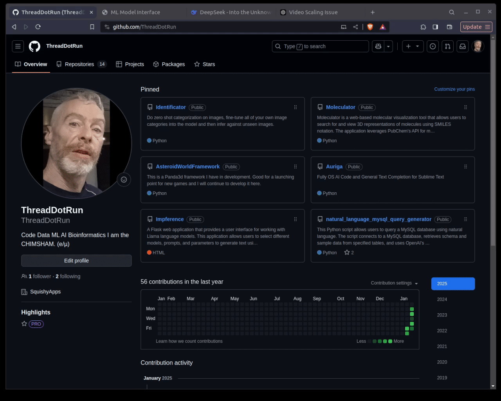

# ML Model Interface: Image Classification and Fine-Tuning

This project provides a web interface for classifying images and fine-tuning machine learning models using OpenAI's CLIP. It is built using Quart for asynchronous web handling, PyTorch for model management, and transformers for easy use of the CLIP model.

## Features

- **Classify Images**: Upload an image and classify it against a list of custom classes.
- **Fine-Tune Models**: Upload a ZIP file containing image folders to fine-tune the model.
- **Results Display**: View detailed results for both classification and fine-tuning.

## Demo



## Installation

To run the project locally, follow the steps below:

### Prerequisites

- Python 3.8 or higher
- Pip (package manager)
- Git (for cloning the repo)

### Steps

1. Clone the repository:

   ```bash
   git clone https://github.com/your-username/ML-Model-Interface.git
   cd ML-Model-Interface
   ```

2. Install the required dependencies:

   ```bash
   pip install -r requirements.txt
   ```

3. Run the Quart web server:

   ```bash
   python Discriminator.py
   ```

   The web interface will be available at `http://localhost:5000`.

### Requirements

Make sure you have the following Python packages installed:

- `quart`
- `torch`
- `transformers`
- `PIL` (Pillow)
- `werkzeug`
- `torchvision`
- `asyncio`

You can install them using:

```bash
pip install quart torch transformers Pillow werkzeug torchvision
```

## How to Use

### 1. Classify Images

- Upload an image to classify.
- Enter a comma-separated list of classes, such as `cat,dog,bird`.
- Click on "Upload and Classify" to receive the classification results.

### 2. Fine-tune Model

- Upload a ZIP file containing image folders (e.g., a folder for each class).
- Click on "Upload and Fine-tune" to fine-tune the model on your dataset.
- After training, view the loss history from the fine-tuning process.

## Folder Structure

- `static/`: Contains static files such as CSS.
- `templates/`: HTML files for rendering the web interface.
- `app.py`: The main application file containing the Quart server and route logic.
- `Classify.py`: Class for image classification using CLIP.
- `FineTune.py`: Class for fine-tuning the CLIP model on custom datasets.
- `images/`: Directory for storing uploaded images (ensure you have the right permissions).

## License

This project is licensed under Apache 2.0 - see the [LICENSE](Apache 2.0) file for details.

## Acknowledgments

- [OpenAI's CLIP Model](https://github.com/openai/CLIP)
- [PyTorch](https://pytorch.org/)
- [Transformers by Hugging Face](https://huggingface.co/transformers/)

## Issues

If you encounter any issues, please open an issue [here](https://github.com/your-username/ML-Model-Interface/issues).